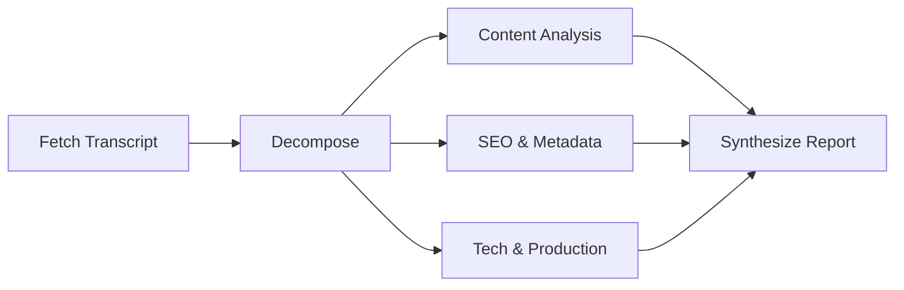

# Video Optimization Analysis — Multi-Agent Kanban Pipeline

Use when the user asks for optimization suggestions on a YouTube video (content, SEO, production, or full audit).

## Prerequisites

- Transcript of the video (see `youtube-content` skill for extraction paths)
- Available kanban profiles (check with `hermes profile list`)

## Pipeline Structure



Three parallel analysis lanes, one synthesis task that depends on all three.

## Standard Task Graph

### T1 — Content Structure & Engagement Audit
Assignee: whichever profile handles analysis/writing

- Opening hook effectiveness (first 30s retention)
- Information density & pacing
- Story arc (is there one, or is it linear coverage?)
- Engagement moments: humor, tension, learning value
- Ending & CTA quality
- Output: structured report with scoring card (6-8 dimensions)

### T2 — YouTube SEO & Metadata Optimization
Assignee: whichever profile handles SEO

- Title optimization (search vol vs CTR tradeoffs)
- Description rewrite (hook + keywords + structured info)
- Hashtag strategy (tiered: broad → situational → niche)
- YouTube Chapters (timestamped, keyword-rich)
- Thumbnail analysis & A/B test direction
- Output: full SEO recommendation report

### T3 — Technical Production & Retention Audit
Assignee: whichever profile handles production analysis

- Audio quality (wind noise, mic type, ambience)
- Visual quality (stability, lighting, framing)
- Editing style (pacing, BGM, transitions, overlays)
- Mobile-first viewing experience
- Competitive production benchmarking (within niche)
- Output: production audit report

### T4 — Synthesis Report (depends on T1, T2, T3)
Assignee: synthesis-capable profile

- Read all three sub-reports
- Prioritize findings into P0-P3 tiers:
  - P0: zero-cost, do today (subs, description, CTA)
  - P1: next shoot prep (thumbnail, hook structure, hashtags)
  - P2: 1-4 week investment (mic, overlay templates, narrative structure)
  - P3: 1-3 month strategy (branding, series planning, engagement design)
- Group into fast/slow action plan table
- Output: single comprehensive report deliverable to creator

## Implementation Notes

### Task creation order

```bash
# 1. Create parallel tasks (no parents)
t1=$(hermes kanban create "分析: <title> — 內容結構與觀眾互動審計" --assignee <profile> --body "...")
t2=$(hermes kanban create "SEO: <title> — YouTube SEO 與 metadata 優化" --assignee <profile> --body "...")
t3=$(hermes kanban create "技術: <title> — 製作品質與觀眾留存審計" --assignee <profile> --body "...")

# 2. Capture IDs and create synthesis with parent links
hermes kanban create "綜合: <title> — 完整優化建議報告" --assignee <profile> --parent <T1_ID> --parent <T2_ID> --parent <T3_ID> --body "..."
```

### Transcript sharing across tasks
- Save transcript to a durable path (not `/tmp/` — kanban workers may not start before temp cleanup)
- Add a comment to each task with the transcript path
- Recommended: `$DEV_PROJECTS/transcript_<VIDEO_ID>.txt`

### Output locations
- Each worker's report lands in its scratch workspace: `$HERMES_HOME/kanban/workspaces/<task_id>/`
- Final synthesis report: same location, single markdown file

### Session documentation
After pipeline completion, the user expects:
1. 工作日誌 → `~/hermes_log/YYYY-MM-DD.md` (table: #/time/summary/result)
2. Detailed note → separate `.md` with full findings and P-tier structure
